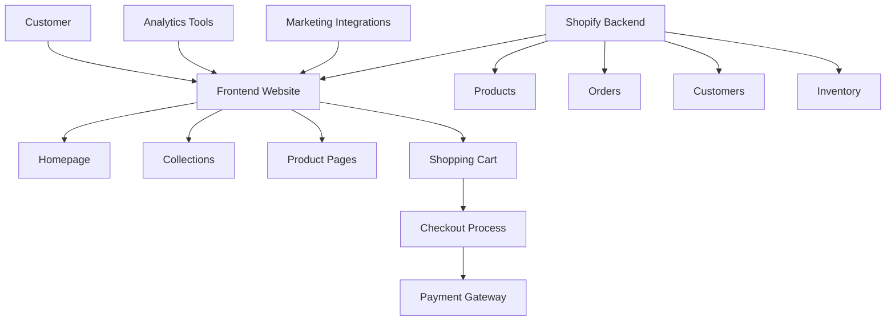

# Architecture Diagram

```mermaid
flowchart TD

A[Customer] --> B[Frontend Website]

B --> C[Homepage]
B --> D[Collections]
B --> E[Product Pages]
B --> F[Shopping Cart]

F --> G[Checkout Process]

G --> H[Payment Gateway]

I[Shopify Backend] --> B

I --> J[Products]
I --> K[Orders]
I --> L[Customers]
I --> M[Inventory]

N[Analytics Tools] --> B

O[Marketing Integrations] --> B

```
